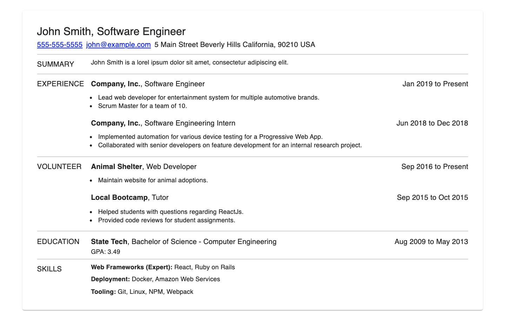

## resume-react

A component library built around [JSONResume](https://jsonresume.org/) data to help craft a resume
for web and print content.



### Example

```js
import { Heading, Content, Work } from "resume-react";
import { makeStyles } from "@material-ui/core/styles";

// Material UI's makeStyles is used, but any styling can be applied
const exampleStyles = makeStyles({
  resume: {
    padding: "32px",
    "& > :not(:first-child)": {
      paddingTop: "8px",
    },
    "& > :not(:last-child)": {
      borderBottom: "solid 1px #CFCFCF",
      paddingBottom: "8px",
    },
  },
});

export const Example = () => {
  const classes = exampleStyles();
  return (
    <div className={classes.resume}>
      <Heading
        name="John Smith"
        title="Software Engineer"
        email="john@example.com"
        location={{
          address: "5 Main Street",
          city: "Beverly Hills",
          region: "California",
          postalCode: "90210",
        }}
      />
      <Content title="SUMMARY">
        <span>John Smith is a lorel ipsum doloar sit amet</span>
      </Content>
      <Content title="EXPERIENCE">
        <Work
          name="Company, Inc."
          position="Software Engineer"
          startDate="2019-01-01"
          highlights={[
            "Lead web developer for entertainment system for multiple automotive brands.",
            "Scrum Master for a team of 10.",
          ]}
        />
      </Content>
    </div>
  );
};
```

### Component Definitions

Todo
